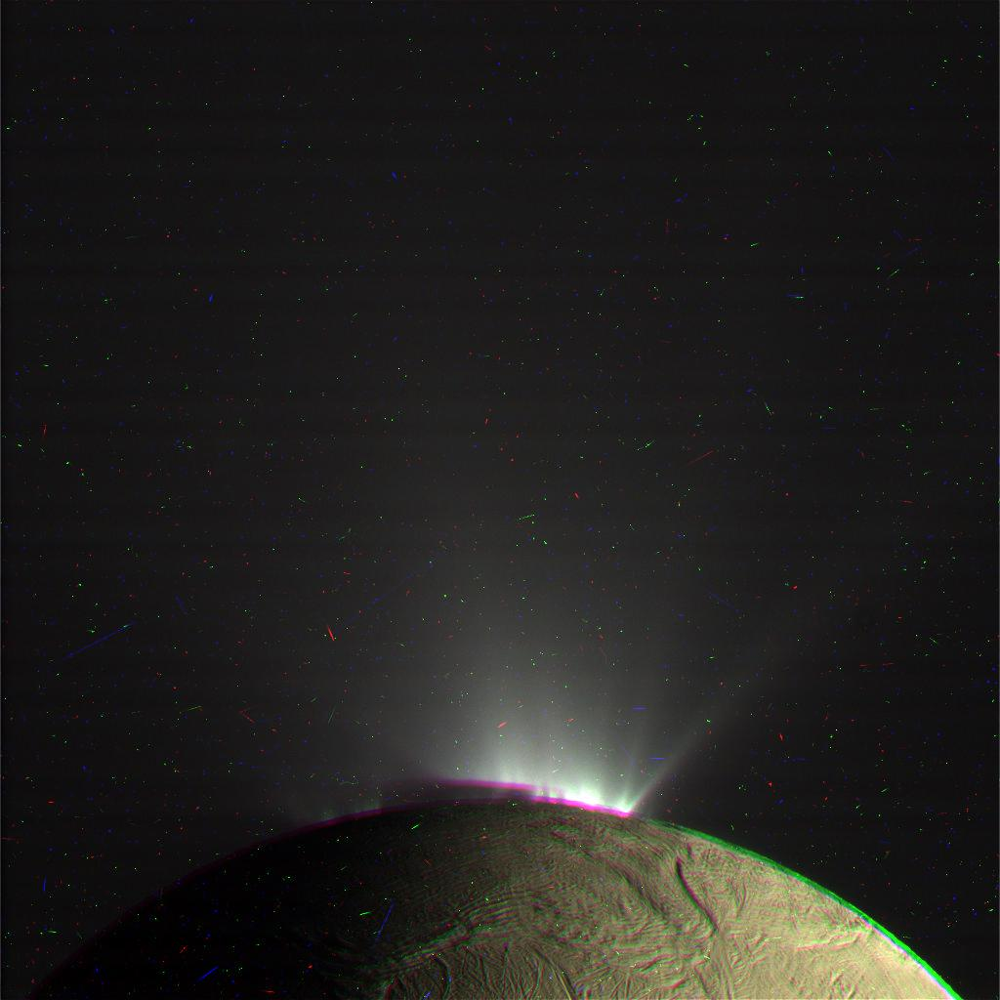

# gostitcher

This project is my attempt to learn the go language by building an application that can stitch together the monochrome color photos taken by space probes into visible color photos.

## Iterations

My iterations are based on the following manual process that is outlined by Emily Ladawalla in [Tutorial: Making RGB Images in Photoshop](http://www.planetary.org/explore/space-topics/space-imaging/tutorial_rgb_ps.html). I am using the same images of Reha against Saturn from the Cassini space probe.

These iterations are run by specifying a `--path <path>` parameter where the path points to a folder containing source images and a config.json file matching the images to the filter used to take them.

### 1. Color Masking

The manual tutorial uses a layers and channels tool of Photoshop. My first attempt to replicate the color combining in an automated fashion involved converting the gray scale images to an alpha mask and then layer the images on top of each other. This attempt produced a very red image and applied the red layer last. Thus I tried changing the order to have the blue image last and it produced a very blue result. This indicates that this approach is not replicating the channels approach and is not blending the colors together.

Red Image|Blue Image
----------|----------
|

### 2. Color Blending

To replicate the channel approach of the tutorial, this approach uses the Gray value from the three images as the RGB values of the resulting color pixel. This approach was much more successful than masking and generated an appropriate image.

### 3. Alignment

This iteration attempted to align images by minimizing the subtracted images. The initial attempt at this did not seem to produce fundamentally better images with the minimization selecting the original alignment for blue and red, and picking an alignment with a clear arc for blue and green. I have not gone any further with this current approach.

Blue Green Original Subtraction|Blue Green "Optimal" Subtraction|Blue Red Original & "Optimal" Subtraction
--------|----------|--------------
||

## OPUS API

[OPUS](https://tools.pds-rings.seti.org/opus/about/) is a data search tool for NASA outer planets missions, a project of the [Planetary Rings Node](http://pds-rings.seti.org/). It provides a way to search for images across most of the metadata available for those images.

This mode of gostitcher uses the search tools to identify observations with a full set of RGB images and then combines them with the V2 algorithm above. Since this does no alignment results are not publication ready but this can be an effective tool to preview which observations are likely to have promising images.

Further refinements might include:
- Being more selective about images when multiple options for each filter are available.
- Providing additional search refinement in addition to target.
- Hosting as a web service to explore opus images.
- Figure out if images other than the preview (e.g. the calibrated images) could be better used. Note that the two data sources created images of rhea of different colours.

This mode is run by specifying a `--target <target>` where the target is one of the values in http://tools.pds-rings.seti.org/opus/api/meta/mults/target.json?planet=Saturn. Note the target is case insensitive here.

Some promising images of Enceladus and Rhea:

### Rhea

### Enceladus

